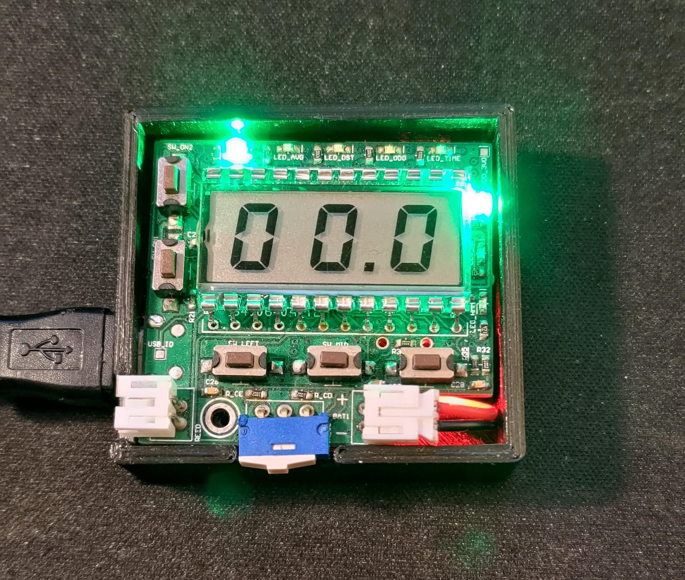
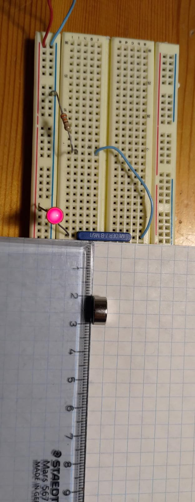
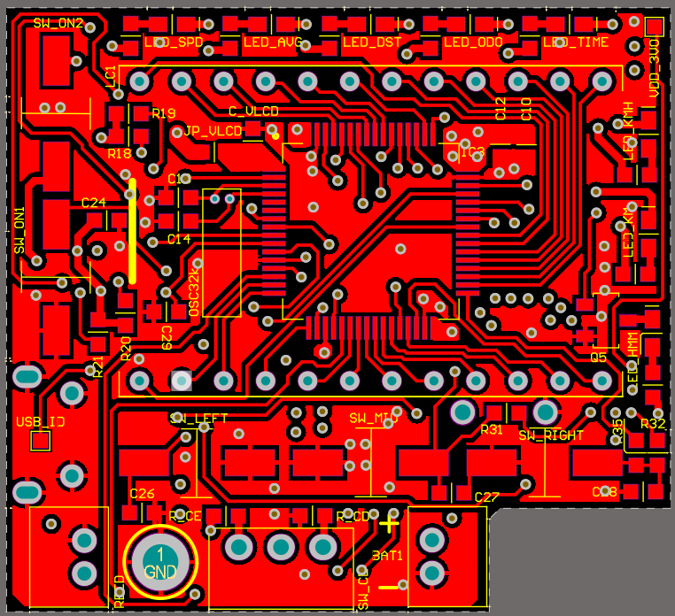
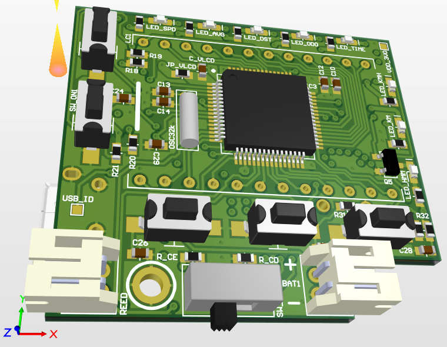

# BICYCLE SPEEDOMETER PROJECT
*A simple LCD bicycle speedometer. This project is a work in progress.*

## Purpose
This project is an exercise in embedded systems, and as an excuse to use 7-segment LCDs. With some refinement, it can be turned into a useable product. This is a home project, not optimized for mass production, but rather for hand-soldering, simple handling, and parts availability. The housing can be 3D printed.

## Description
A custom low-power digital speedometer for a bicycle, built around an STM32 microcontroller with integrated LCD driver. This project emphasizes hardware efficiency, clear UI, and compact design — using a reed switch instead of a hall sensor for speed sensing, and a low-power LCD segment display. It is still under development, with core functionality working and additional features planned.

## Overview
- Displays real-time speed on a 3-digit 7-segment LCD with one decimal precision
- Reed switch and magnet used for wheel rotation sensing
- Custom PCB with STM32L053R6T6, featuring onboard LCD driving and USB debug interface
- 350 mAh Li-Po battery with integrated charging via USB
- Buttons for scrolling through displays (current speed, average speed since reset, distance since reset, driving time since reset, odometer)
- Designed for ultra-low power operation (with further optimization planned)

## Project status
Currently the project can achieve the core function of the speedometer: measure the speed, and display it on the display, as well as charge the battery.

The magnet and sensor are on the bicycle which couldn't fit in this picture. Top cover is also not shown.

## System architecture
### Microcontroller
The system is based on a STM32L053R6T6 microcontroller. The MCU has an LCD driver built-in, and is low-power. The CPU is a Cortex-M0, which is plenty for this application. The MCU reads the reed switch status, calculates the speed, displays it on the LCD, monitors the battery, stores data.
### Display
The display on this device is made of two parts: the 7-segment LCD, and indication diodes. The diodes show the meaning of the current information on the display, and the units. While the LCD power consumption is very low, the diodes are not an optimal choice for low power. It is possible to order custom LCDs for a reasonable price, so a future addition to the project will be to replace the indication diodes to marked LCD segments. Each LCD segment has a separate driving pin on the microcontroller. The pins are chosen in such a way to simplify routing. A look-up table is created in software to turn on the correct segments for displaying each digit.
### Sensor
The sensor is activated by a magnet attached to the wheel spokes. The sensor is a simple reed switch. This is done to minimize current draw. A Hall effect sensor or Hall effect switch constantly consumes a few mA, whereas the reed switch only draws current during the small percantage of the rotation period when it is closed by the magnet on the wheel, and that current is limited by a pull-up resistor. Due to the nature of using a mechanical switch, it is prone to bouncing. That is why an RC filter is implemented, as well as debounce software. The magnet is strong enough to keep the switch closed for a significant enough portion of the period to allow time for the bouncing to settle.

The image on the left shows the activation distance for the magnet. The image on the right is the reed switch's bouncing effect.

### Battery
The project uses a massive 350mAh rechargable Li-Po battery. The battery is charged via USB through a power management IC, which handles constant current and constant voltage handling, as well as power supply switchover. With more detailed analysis of power optimization, this battery can be replaced with a non-rechargable coin cell.
### Speed calculation
The speed is calculated based on the rotation period of the wheel: with a known diameter (the user must input the diameter of the exact wheel on the bicycle) and a measured time for a full rotation, it is easy to calculate the current speed. However, in order to not update the display with every wheel rotation (it would be difficult for the rider to read the display with such rapid changes), the measurements are averaged over a 2-second period. At the end of each 2-second period, the speed during that period is calculated, and the display is refreshed. If one or zero magnet passes are detected during this 2-second window, the displayed speed is 0. Therefore, there is a minimum measurable speed, which is just under 1m/s for a 27.5-inch wheel. This speed is slower than walking speed, and riders are not expected to be cycling at such low speeds.
### Layout
There are no high-speed signals here. The layout is placed on a 4-layer board solely due to space constraints. The MCU and some components are placed on the same layer but below the LCD (see 3D render without the LCD shown).

## Firmware
### Implemented features
- [x] Lookup table for LCD digit segments
- [x] Speed calculation
- [x] Reed relay debouncing (HW + SW)
- [x] Power on/off control
- [x] Status LED control
- [x] Battery charging
### Planned features
- [ ] Low power and stanby modes
- [ ] Average speed calculation, distance calculation, ride time calculation, odometer
- [ ] Non-volatile trip data storage
- [ ] Previous/Next/Select screen navigation handling
- [ ] Wheel size selection menu
